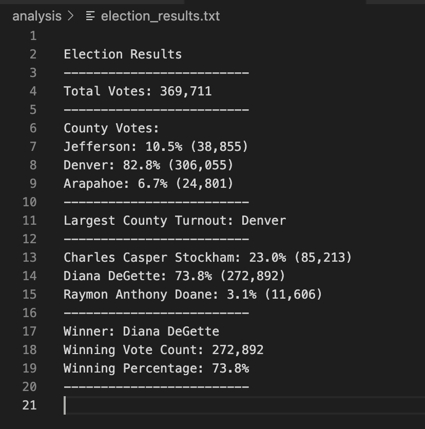

# Election_Analysis

## Overview

The purpose of this project is to automate the process of performing an election audit and publishing the results for a US Congressional precinct in Colorado, using Python, for our client Tom who works for the Colorado Board of Elections. The election data and votes cast are available in tabulated form with the Central office from the different voting methods.


## Results

The following are the election outcomes:

- A total of 369,711 votes were cast in the Congressional election.
- Of the total votes, Jefferson county got 10.5% with a total of 38,855 votes. Denver got a large share of 82.8% with a total of 306,055 votes. Arapahoe got 6.7% with a vote count of 24,801.
- Denver got the largest number of votes with 306,055 votes, a vote share of 82.8%.
- Among the candidates, Charles Casper Stockham received 23.0% of the votes with a vote count of 85,213 votes.Diana DeGette received 73.8% of the votes, with 272,892 votes.Raymon Anthony Doane got 3.1% of the votes with 11,606 votes.
- The winner of the election was Diana DeGette with a 73.8% vote share with 272,892 votes.
The results output on the .txt file can be seen in the image below. 


The actual .txt file is linked at [Election results](analysis/election_results.txt).

## Summary

The Python script used to calculate the election results for the Colorado congressional districts, can be applied on a larger scale to calculate results of state elections or senatorial elections.

The current script reads data that is available in tabulated form that comprises of Ballot ID, County name and Candidate name. It then iterates through the rows of data and calculates the total number of votes cast, by cumulating the rows. 

The number of votes cumulated per candidate and per county along with percentage share of votes, is also calculated. This is possible by creating a list of each unique candidate name and a dictionary that cumulates the Candidate vote value, against each candidate name key. The same logic is applied to calculate the vote count per county.

These calculated details are then output on the terminal as well as on a text file along with the Winning candidate details.

The script can be modified and applied to make calculations in other types of elections, by using "District" or "state" , instead of "county" depending on the nature of election.The votes can then be aggregated by the new variable and displayed in the same fashion. The code that needs to be changed can be seen below:

```
 # 6a: Write a for loop to get the county from the county dictionary.
    for county_name in countyvotes_dict:
        # 6b: Retrieve the county vote count.
        countyvote_count = countyvotes_dict.get(county_name)
        # 6c: Calculate the percentage of votes for the county.
        countyvote_percentage = float(countyvote_count) / float(total_votes)*100

        # 6d: Print the county results to the terminal.
        county_results = (f"{county_name}: {countyvote_percentage:.1f}% ({countyvote_count:,})\n")
        
        print(county_results)
         # 6e: Save the county votes to a text file.
        txt_file.write(county_results)
         # 6f: Write an if statement to determine the winning county and get its vote count.
        if (countyvote_count > winning_county_count) and (countyvote_percentage > winning_county_percentage):
            winning_county_count = countyvote_count
            winning_county = county_name
            winning_county_percentage = countyvote_percentage

    # 7: Print the county with the largest turnout to the terminal.
    Largest_county_Turnout = (
        f"-------------------------\n"
        f"Largest County Turnout: {winning_county}\n"
        f"-------------------------\n")
    print(Largest_county_Turnout)

    # 8: Save the county with the largest turnout to a text file.
    txt_file.write(Largest_county_Turnout)
 ```

Also, the code could be modified to aggregate data across multiple levels based on election type. For instance, if data is available, we could calculate the vote counts / turnout by State and by districts within each State,for say the US House of Representatives election. This would involve adding  For Loops, for both State calculations, and district level calculations and displaying them.

Thus it can be seen that this Python script can be used in multiple scenarios, with minor tweaks thereby expanding its application to different elections. Therefore it can be a useful tool for the Election Commission, in combing through large amounts of data and automating the calculation of election results.


